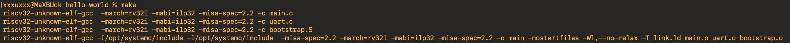
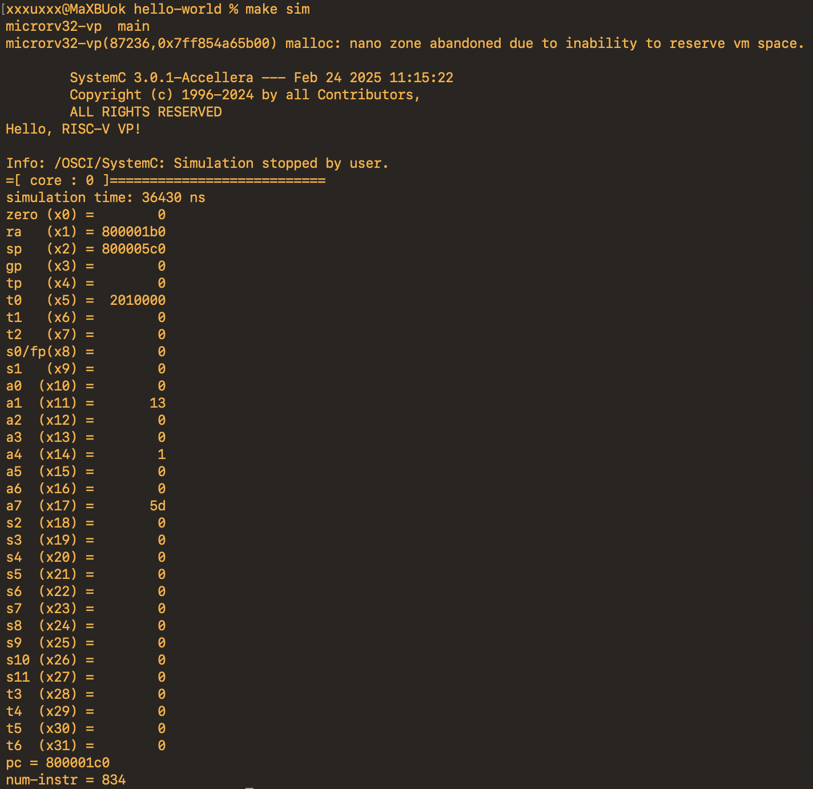

## Deploy RISCV-VP on macOS

### Prerequisites

1. Install command line developer tool

   ```shell
   xcode-select --install
   ```

2. Install homebrew

   ```shell
   /bin/bash -c "$(curl -fsSL https://raw.githubusercontent.com/Homebrew/install/HEAD/install.sh)"
   ```

3. Install prerequisites

   ```shell
   brew install python3 gawk gnu-sed make gmp mpfr libmpc isl zlib expat texinfo flock libslirp cmake boost 
   ```

### RISCV gcc toolchain

1. Install gnu-toolchain (Use the method you like)

   - Using official riscv-gnu-toolchain (***May take a long time***)

     ```shell
     git clone https://github.com/riscv/riscv-gnu-toolchain.git
     cd riscv-gnu-toolchain
     git submodule update --init --recursive # this may take a while
     ./configure --prefix=$(pwd)/../riscv-gnu-toolchain-dist-rv32imac-ilp32 --with-arch=rv32imac --with-abi=ilp32
     make -j4
     ```

   - Using pre-built one (Faster Way)

     Download from: https://github.com/xpack-dev-tools/riscv-none-elf-gcc-xpack/releases/

     > [!CAUTION]
     >
     >  If you choose to use this xpack-riscv toolchain, please change the ***sw/Makefile.common*** by:
     >
     > Line 1: "RISCV_PREFIX ?= riscv32-unknown-elf- " --> "RISCV_PREFIX ?= riscv-none-elf- "

2. Export the toolchain to system environment

   ```shell
   echo 'export PATH="<YOUR_PATH_TO_TOOLCHAIN>/bin:$PATH"' >> ~/.zshrc
   ```

   For the example of using xpack-riscv toolchain:

   ```shell
   echo 'export PATH="/Users/xxx/workplace/xpack-riscv-none-elf-gcc-14.2.0-3/bin:$PATH"' >> ~/.zshrc
   ```

### RISCV-VP

1. Download git repo

   ```shell
   git clone https://github.com/espxar/riscv-vp
   cd riscv-vp
   git submodule update --init --recursive
   ```

2. Choose the correct branch according to the silicon of your Macbook

   1. For Apple silicon

      ```shell
      git checkout RISCV-VP/macOS/arm_architecture
      ```

   2. For Intel silicon

      ```shell
      git checkout RISCV-VP/macOS/intel_architecture
      ```

3. Build SystemC library

   ```makefile
   make sc
   ```

4. Build riscv-vp binary

   ```makefile
   make vps
   ```

5. Export riscv-vp to system environment

   ```makefile
   echo 'export PATH="<YOUR_PATH_TO_RISCV_VP>/vp/build/bin:$PATH"' >> ~/.zshrc
   ```

   For example:

   ```makefile
   echo 'export PATH="/Users/xxx/workplace/riscv-vp/vp/build/bin:$PATH"' >> ~/.zshrc
   ```

> [!NOTE]
>
> Each time you change your systemc source code, you should rebuild riscv-vp binary, i.e. make vps, to make your change effective.

### Run hello-world on riscv-vp

1. Go to the software folder

   ```shell
   cd sw/hello-world
   ```

2. Use riscv-gcc to compile the c code

   ```shell
   make
   ```

   You should see terminal logs like:

   

3. Run riscv-vp simulation

   ```shell
   make sim
   ```

   You should see terminal logs like:

   


*Good luck for your development :)*